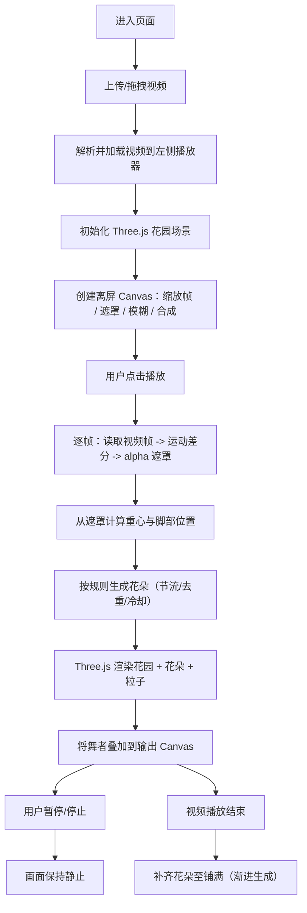

## 1. 产品概述
一个单文件 HTML 网页应用：上传舞蹈视频后，左侧播放原视频，右侧实时合成“舞者在莫奈花园中跳舞”的画面（Three.js 花园 + 基于像素运动检测的舞者抠像叠加），并根据舞者行走轨迹在花园地面持续“种花”直至铺满。
- 主要目的：用纯前端方式实现“视频舞者抠像 + 3D 场景合成 + 轨迹生花”的沉浸式视觉实验
- 目标用户：希望快速体验创意合成效果的普通用户、互动艺术/新媒体创作者、前端/图形开发学习者
- 价值：无需 API Key、无需安装环境，打开网页即可演示可运行的实时合成与生成式场景效果

## 2. 核心功能

### 2.1 用户角色
不区分角色，所有用户均可使用全部功能。

### 2.2 功能模块
1. **上传与播放**：拖拽/点击上传 mp4/webm；显示时长、可播放/暂停、进度条跳转
2. **实时抠像**：基于相邻帧差分的像素运动检测生成 alpha 遮罩；将舞者叠加到合成画布
3. **3D 莫奈花园**：Three.js 渲染草地/树影/天空渐变/雾；广角平视相机；自然光照
4. **轨迹生花**：从遮罩重心估算舞者脚部附近地面位置；按时间节流生成花朵；支持跳转不重置花朵状态
5. **粒子点缀**：偶尔飘过花瓣/光点，增强氛围

### 2.3 页面详情
| 页面名称 | 模块名称 | 功能描述 |
|---|---|---|
| 单页应用 | 顶部上传区 | 居中虚线边框，可点击/拖拽；仅接受 mp4/webm；上传后自动加载到左侧播放器 |
| 单页应用 | 左侧原视频 | 占 50% 宽度；显示原视频；与右侧合成保持相同播放/暂停/跳转状态 |
| 单页应用 | 右侧合成画面 | 占 50% 宽度；底层 Three.js 场景；中层离屏 Canvas 生成舞者遮罩；上层舞者叠加；播放时实时更新，暂停时静止 |
| 单页应用 | 底部进度条 | 暗金滑块；拖动跳转；跳转时仅更新舞者画面，花朵保持已生成状态 |

## 3. 核心流程
用户上传视频后，系统初始化花园场景与离屏处理管线；播放时以视频时间为驱动更新“抠像→叠加→生花→渲染输出”；跳转时不清空花朵状态；播放结束时花园填满花朵。

## 4. 用户界面设计

### 4.1 设计风格
- 背景色：#1a1a24
- 卡片背景：半透明深色 #222233CC
- 边框：1px solid #3a3a50
- 文字颜色：#d0cfc0
- 强调色：#c9a96e（暗金）
- 字体：系统默认衬线字体（桌面优先）
- 上传区域：暗金虚线边框，hover 发光
- 圆角与阴影：8px 圆角，细腻投影增强层次
- 分隔线：左右画面之间 1px 半透明分隔
- 进度条：暗金色滑块与轨道高对比，支持拖拽

### 4.2 页面设计概览
| 页面名称 | 模块名称 | UI 元素 |
|---|---|---|
| 单页应用 | 顶部上传区 | 居中；虚线边框；拖拽态高亮；显示格式限制提示 |
| 单页应用 | 双画面区域 | 左：原视频；右：合成 Canvas；中间细分隔；两侧同高自适应 |
| 单页应用 | 控制条 | 播放/暂停按钮；时间显示；进度条；细节统一暗金点缀 |

### 4.3 响应式
- 桌面优先：≥ 960px 时左右并排 50%/50%
- 小屏：上下排列（原视频在上，合成在下），进度条保持可用
- 触控优化：进度条滑块更大，避免误触

### 4.4 3D 场景指引
- 氛围：柔和、略带粉紫的天空渐变；午后暖金光
- 光照：暖金色定向光 + 柔和环境光；轻微阴影/明暗层次
- 相机：高度约 1.5m，略仰角或平视；广角 FOV 80–90；保持平视广角的“人在花园里”感受
- 景深感：使用 Fog 让远处花朵/树影更“朦胧”；近景更清晰
- 构图：地面从脚下延伸到远处，透视明显；树影与灌木作为远景轮廓
