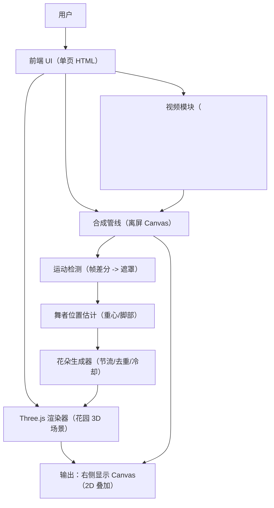

## 1. 架构设计

## 2. 技术说明
- 前端：原生 HTML + CSS + JavaScript（单文件交付）
- 3D 引擎：Three.js r160（CDN：`https://cdn.jsdelivr.net/npm/three@0.160.0/build/three.min.js`）
- 视频处理：`<video>` + 离屏 Canvas（缩放帧 320x180）+ ImageData 逐像素差分
- 遮罩软化：2D Canvas 模糊（`ctx.filter = "blur(2px)"`）或双层缩放近似模糊
- 合成输出：最终渲染在右侧可见 Canvas；底层来自 Three.js（WebGL 渲染器）输出到其 canvas，再绘制到 2D 合成 canvas 作为底层
- 后端：无
- 外部服务：无（不使用任何 API Key）

## 3. 路由定义
| 路由 | 用途 |
|---|---|
| / | 单页应用：上传、播放、实时合成与生花 |

## 4. 模块划分（前端）
| 模块 | 职责 | 关键输入/输出 |
|---|---|---|
| Uploader | 处理拖拽/点击上传、格式校验、加载 video.src | 输入：File；输出：Object URL |
| PlayerSync | 同步播放/暂停/seek；驱动合成循环（requestAnimationFrame） | 输入：video.currentTime；输出：合成时钟 |
| FrameDownscale | 将视频帧绘制到 320x180 隐藏 canvas | 输入：video；输出：ImageData |
| MotionMask | 隔 2 帧做差分，阈值判断亮度变化>25 生成 alpha mask | 输入：当前/上一帧；输出：mask ImageData |
| MaskPost | 对 mask 做轻微模糊与边缘柔化 | 输入：mask；输出：soft mask |
| DancerCompositor | 使用 mask 将原帧绘制为“仅舞者”并叠加到输出 canvas | 输入：video frame + mask；输出：右侧画面上层 |
| ThreeGarden | 初始化场景：草地起伏、远景树影、天空渐变、雾、光照、粒子 | 输出：WebGL canvas 或渲染结果 |
| DancerLocator | 从 mask 计算重心；脚部点取重心下方 15–25% | 输入：mask；输出：2D 屏幕坐标 |
| FlowerManager | 将脚部点映射到地面坐标；每 0.5s 最多 1 朵；1.5s 内同位置不重复；播放结束铺满 | 输入：地面坐标 + 时间；输出：花朵实例列表 |
| FlowerMeshFactory | 按莫奈色板创建花朵（五瓣球体+中心球+茎+叶）并按深度缩放 | 输入：颜色/位置/深度；输出：Three.js Object3D |

## 5. 关键算法与规则落地

### 5.1 像素运动检测抠像（约束实现）
- 缩放：每帧绘制到 320x180 隐藏 canvas
- 采样：隔 2 帧取一次用于差分（降低噪声与 CPU）
- 差分：对每个像素计算亮度差 `|Ycur - Yprev|`
- 阈值：亮度变化 > 25 记为运动像素；否则透明
- 遮罩：运动区域 alpha=255，静止区域 alpha=0
- 柔化：对遮罩做 2px 模糊并轻微提亮 alpha，避免硬边
- 合成：按遮罩 alpha 将原始帧绘制为“仅舞者”，叠加到右侧输出 canvas

### 5.2 花朵生成（基于舞者位置）
- 舞者位置：从遮罩运动像素计算重心（cx, cy）
- 脚部点：取 `cy + h * (0.15~0.25)`（屏幕更靠下）作为近似脚部区域
- 地面映射：将屏幕脚部点投射到 Three.js 地面（Raycaster 与地面网格相交）
- 生成节流：每 0.5 秒最多生成 1 朵（控制密度）
- 去重冷却：同一位置 1.5 秒内不重复生成（按网格化 key 或距离阈值）
- seek 行为：跳转仅更新舞者，花朵状态不回滚（花朵实例常驻场景）
- 结束铺满：播放结束后启动补齐逻辑，以一定节流逐步在地面随机/网格补点直至花朵密集覆盖

## 6. 性能与稳定性策略
- 分辨率控制：运动检测固定 320x180，避免全分辨率差分
- 计算节流：差分隔帧 + 花朵生成节流，避免 CPU 与 GC 抖动
- 渲染分层：Three.js 负责 3D；2D Canvas 负责遮罩与最终叠加，避免复杂的 shader 抠像
- 资源释放：更换视频时释放旧 Object URL；清理旧花朵与粒子实例（必要时）
- 兼容性：仅使用浏览器原生能力与 Three.js；不依赖 WebCodecs/ML 模型
